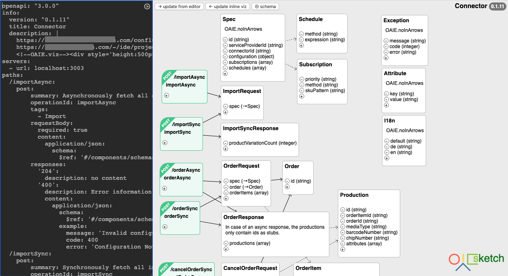

# OAIE Sketch
OAIE Sketch is a browser-based editor for OAS3 spec documents. It offers a side-by-side YAML code editor and visual editor with a focus on tactile feedback, simplicity and performance. Its philosophy is "stay close to the code and visualize".

Online Demo: https://raw.githack.com/OAIE/oaie-sketch/master/sketch.html

## Installation
Currently OAIE Sketch is only a few files plus CDN links. So your process to get it running is manual.
- clone repository
- open sketch.html in browser

## Features
- shows each operation as graph node (path, operationId, summary, parameters)
- shows each schema as graph node (name, description, properties)
- shows each relation as graph arrow (array-relations as dotted)
- dragging for graph nodes
- mass-move to make space for new content (up/down arrows in operation)
- quick action buttons for adding properties and schemas
- clicking schemas or properties will scroll the document
- detects changes and colors sync buttons
- can add a "baked" viz into the document as a viewer storage
- uses viz as metadata (node position) storage
- sync graph into yaml, sync yaml into graph
- auto-save in localstorage of browser

## Opinionated OAS3 YAML
Requests, Responses and sub-objects should be their own schema definitions. Note that this is best practice anyway if you ever want to generate classes from your spec.

    components:
      schemas:
        CapabilitiesRequest:
          required:
            - spec
          properties:
            spec:
              $ref: '#/components/schemas/Spec'
        CapabilitiesResponse:
          properties:
            capabilities:
              type: array
              items:
                $ref: '#/components/schemas/Capability'
        Capability:
          properties:
            method:
              type: string
            skuPattern:
              type: string
        Spec:
          description: OAIE.noInArrows
          properties:
            id:
              type: string
            schedules:
              type: array
              items:
                $ref: '#/components/schemas/Schedule'
        Schedule:
          properties:
            method:
              type: string
            expression:
              type: string

## VIZ
Beginning documents like this will add a viz (visualisation) into the header (this will show up as a graphic in swagger):

    openapi: "3.0.0"
    info:
      version: "0.0.1"
      title: My Service
      description: |
        My introductory information
        <!--OAIE.viz--><!--/OAIE.viz-->
    ...

Sketch persists graph node positions to the browser's localStorage, but when a viz is present, it will store and load graph node positions to and from this viz (inside the &lt;!--OAIE.viz--&gt; tag).

## Caveats
- Currently only tested on Chrome.
- OAIE Sketch has an opinion about correct document structure: each schema should be declared as a named schema.
- local storage is used as persistence. this means that currently it is only feasible to edit one spec at a time (much like the Swagger online editor).
- OAIE Sketch is in a very early stage, please backup your documents frequently outside of it!
- Sync: when both are yellow, first click "<- update inline viz", then "update from editor ->"

## TODO
- documentation
- find contributors
- marketing
- see Projects tab for planned features

## Contributing
- We want to maintain a focus on the code.
- We want to facilitate writing better specs.
- We want to make writing specs easier and give an easier learning curve.
- We want to be as lightweight as possible (currently needs Vue, JS-YAML, jQuery, jQuery UI - help on removing jQuery appreciated!).
- We want to keep the dependency to libraries as low as possible.
