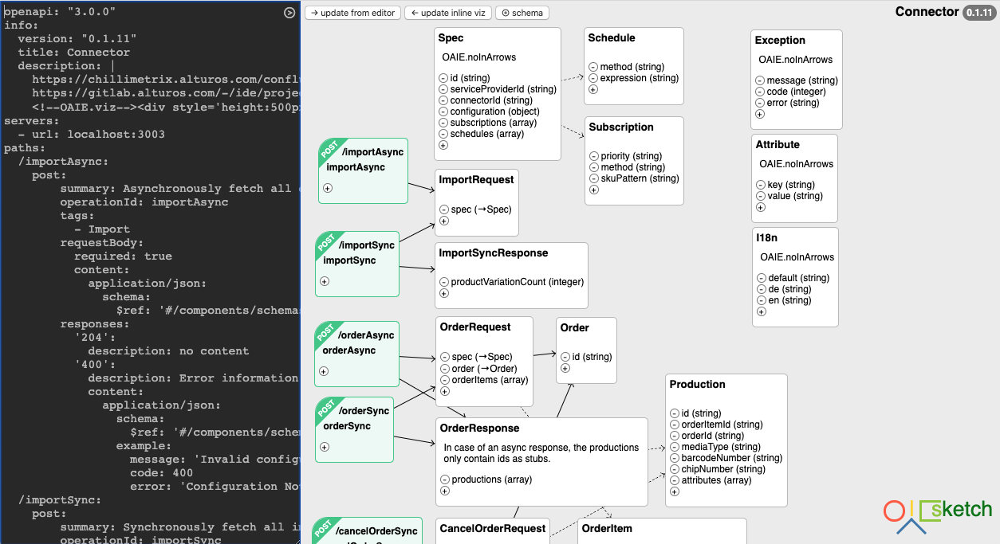

# OAIE-Sketch
OAIE Sketch offers a side-by-side YAML code editor and visual editor with a focus on tactile feedback, simplicity and performance.

## Features
- shows each operation as graph node
- shows each scheam as graph node
- shows each relation as graph arrow
- dragging for graph nodes
- quick action buttons for adding properties and schemas
- clicking schemas or properties will scroll the document
- detects changes and colors sync buttons
- can add a "baked" viz into the document as a viewer storage
- uses viz as metadata (node position) storage
- sync graph into yaml, sync yaml into graph

## VIZ
Starting documents like this will add a viz (visualisation) into the header (this will show up as a graphic in swagger):

    openapi: "3.0.0"
    info:
      version: "0.0.1"
      title: My Service
      description: |
        My introductory information
        <!--OAIE.viz--><!--/OAIE.viz-->

Sketch can persist and load entity positions to and from this viz (inside the <!--OAIE.viz--> tag).

## Caveats
- Currently only tested on Chrome.
- OAIE Sketch has an opinion about correct document structure: each schema should be declared as a named schema.
- local storage is used as persistence. this means that currently it is only feasible to edit one spec at a time (much like the Swagger online editor).
- OAIE Sketch is in a very early stage, please backup your documents frequently outside of it!
- Sync: when both are yellow, first click "<- update inline viz", then "update from editor ->"

## TODO
- documentation
- find contributors
- marketing
- restructure project
- refactor into smaller units
- integrate CodeMirror as editor with yaml tooling
- allow multi-project workflows within the same browser
- show circular references
- git integration
- server for local self-hosting
- global site with hosting
- support yaml features (includes)
- validation
- ...
